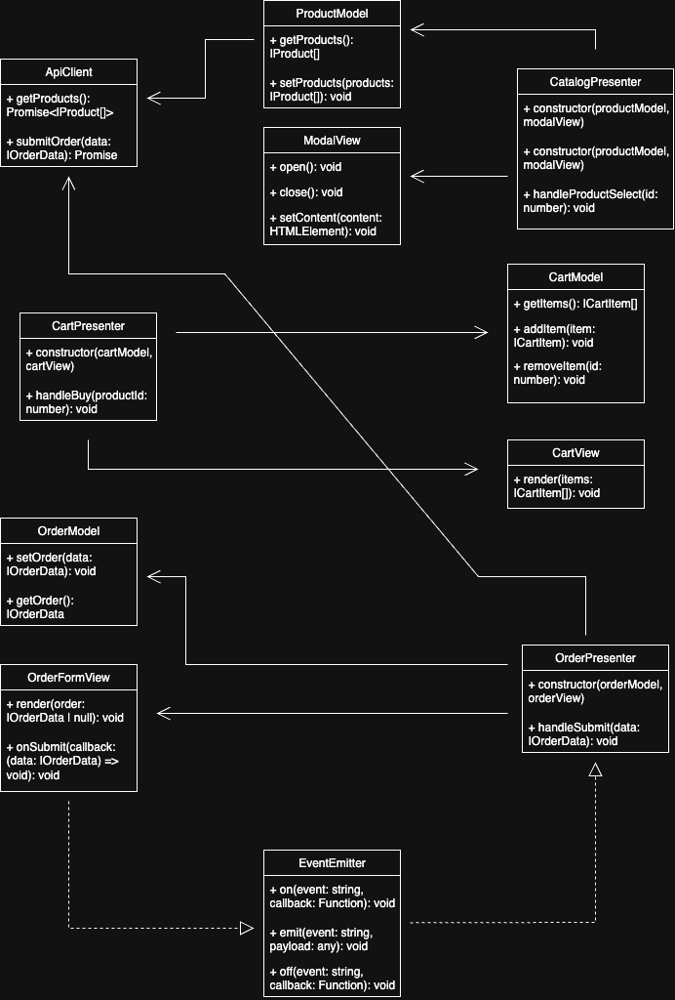

# Проектная работа "Веб-ларек"

Tech stack: HTML, SCSS, TS, Webpack

Project structure:
- `src/` — source code
- `src/components/` — UI components
- `src/components/base/` — base classes and shared logic

Key files:
- `src/pages/index.html` — main HTML page
- `src/types/index.ts` — entry point for app-wide types
- `src/index.ts` — application entry point
- `src/scss/styles.scss` — root SCSS file
- `src/utils/constants.ts` — constants
- `src/utils/utils.ts` — utility functions


## Installation and launch
To install and run the project, use:

```
npm install
npm run start
```

or

```
yarn
yarn start
```
## Build

```
npm run build
```

или

```
yarn build
```

## Architecture

The project follows the MVP (Model — View — Presenter) architectural pattern.

Model — manages data: fetching from the API, storing cart and order state.
View — handles the UI: product cards, modals, cart, and order form.
Presenter — connects models and views, contains business logic.

Architecture is built around a loosely-coupled structure using an EventEmitter (event broker), allowing reusable components and scalable logic.

## Core classes

ProductModel	- Loads and stores product list
CartModel	- Manages shopping cart state
OrderModel	- Stores order information
ApiClient	- Handles API communication
EventEmitter	- Event broker for communication
ProductCardView	- Displays a single product card
ModalView	- Displays modals
CartView	- Displays the shopping cart
OrderFormView	- Displays the checkout form
CatalogPresenter	- Manages the product catalog
CartPresenter	- Manages cart logic
OrderPresenter	- Manages order logic

## Component interaction flow

Example: User clicks a product card
1. `ProductCardView` emits the `product:select` event
2. `CatalogPresenter` receives the event and opens the `ModalView`
3. User clicks "Buy" → `cart:add` event is emitted
4. `CartPresenter` adds the product to the `CartModel`
5. `CartView` updates to reflect changes

## Data types

Types are located in src/types/ and describe the app’s structure:

IProduct — product object
ICartItem — item in the shopping cart
IOrderData — checkout form data
IView, IModel, IPresenter — interfaces for architecture layers
AppEvents, IEvent<T> — event map and payload interface

## UML diagram


